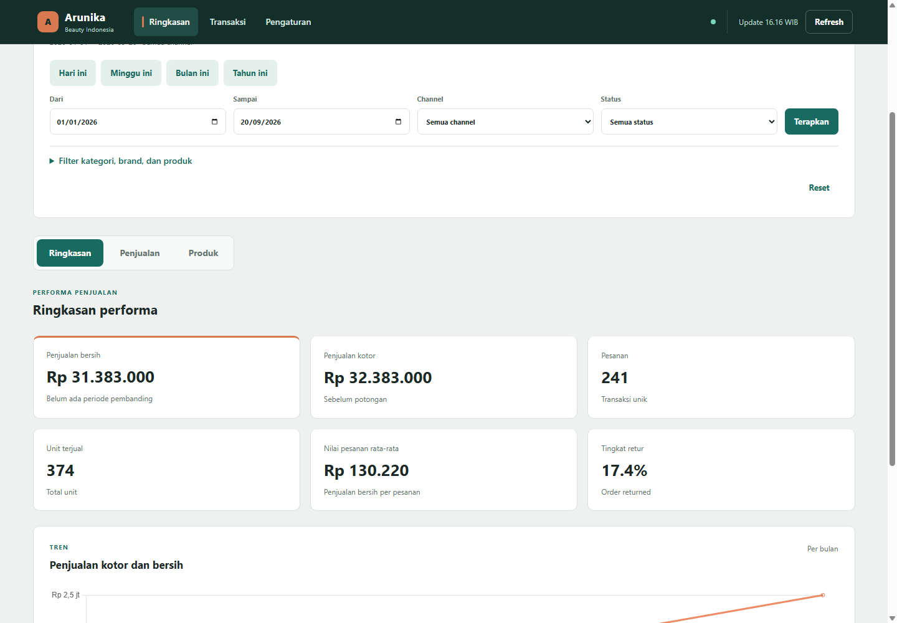
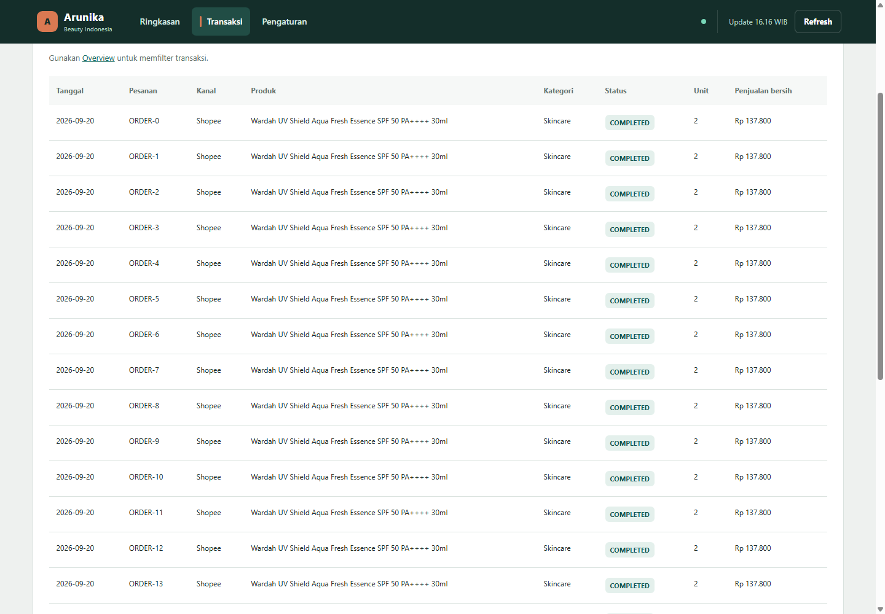
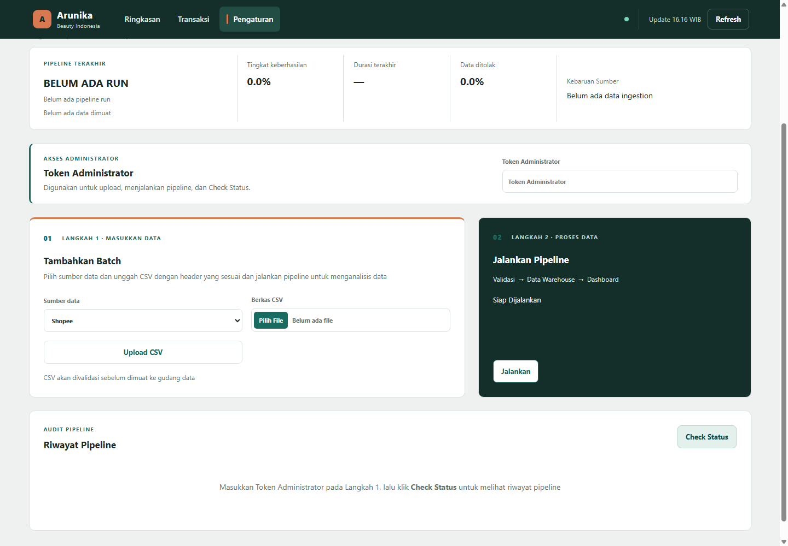

# Arunika Beauty - E-Commerce Sales Data Pipeline

Arunika Beauty adalah proyek data engineering dan analitik penjualan untuk menggabungkan data dari Shopee, Tokopedia, Website, Toko Offline, dan Master Produk. Data diproses secara bertahap sampai menjadi warehouse berbentuk star schema, diaudit, lalu disajikan melalui dashboard penjualan dan Airflow.

Proyek ini dibuat untuk menjawab kebutuhan yang sederhana tetapi penting: **berapa penjualan yang terjadi, dari kanal mana, produk apa yang paling berkontribusi, bagaimana kualitas datanya, dan apakah pipeline berjalan dengan sehat?**

Dokumen ini adalah pintu masuk proyek. Gunakan bagian Quick Start untuk menjalankan sistem, bagian Penggunaan Dashboard untuk memahami alur kerja, dan dokumentasi lanjutan untuk detail teknis.

```text
CSV source -> raw -> validasi -> staging -> warehouse -> analytics -> dashboard
```

## Tampilan Dashboard

Dashboard Arunika memakai layout yang ringkas: navbar global, ringkasan KPI, filter periode, analitik penjualan, transaksi detail, serta halaman pengaturan pipeline. Warna utama menggunakan teal Arunika dengan orange sebagai aksen identitas.

### Ringkasan



### Transaksi



### Pengaturan




## Fitur Utama

- Mengambil data penjualan dari lima jenis sumber CSV.
- Memvalidasi struktur dan isi data sebelum masuk ke warehouse.
- Menyimpan metadata ingestion, hasil validasi, lineage, dan audit pipeline.
- Memuat dimensi dan fact sales ke PostgreSQL star schema.
- Menghindari pemuatan ulang baris yang identik melalui fingerprint/hash.
- Menampilkan KPI penjualan, tren bulanan, kanal, status pesanan, kota, merek, kategori, SKU, dan produk terlaris.
- Menyediakan filter tanggal, kanal, status, kategori, merek, dan produk.
- Menyediakan tabel transaksi dengan pagination dan export CSV.
- Menyediakan halaman Pengaturan untuk upload CSV, menjalankan pipeline, dan melihat riwayat eksekusi.
- Menjalankan pipeline terjadwal melalui Apache Airflow.
- Mengirim laporan pipeline melalui email jika SMTP dikonfigurasi.

## Stack Teknologi

| Bagian | Teknologi |
| --- | --- |
| Bahasa utama | Python 3.12+ |
| Web dashboard | Flask, HTML, CSS, JavaScript ES modules |
| Web server | Waitress |
| Database | PostgreSQL 16 |
| Akses database | SQLAlchemy, psycopg, asyncpg |
| Transformasi data | pandas |
| Migration | Alembic |
| Orkestrasi | Apache Airflow 3.3 |
| Visualisasi | Chart.js lokal, Plotly untuk analisis |
| Container | Docker dan Docker Compose |
| Pengujian | pytest, browser smoke test berbasis Node.js dan Chromium/Edge |
| Quality tools | Ruff dan pre-commit |
| Zona waktu | `Asia/Jakarta` / WIB |

### Visual Stack

#### Runtime dan Web

<p>
   
   
   
   
</p>

#### Data dan Database

<p>
   
   
   
   
</p>

#### Orkestrasi dan Infrastruktur

<p>
   
   
   
</p>

#### Quality dan Pengujian

<p>
   
   
   
   
</p>

> Badge di atas berfungsi sebagai ringkasan visual. Tabel sebelumnya menjelaskan peran setiap teknologi di dalam proyek.

## Arsitektur Proyek

```text
Ecommerce Sales/
|- airflow/                 DAG dan konfigurasi orkestrasi
|- alembic/                 Migration database
|- analisis/                Notebook analisis eksploratif
|- dashboard/               Flask app, template, CSS, JavaScript, dan smoke test
|- data/source/             CSV sumber penjualan dan master produk
|- data/processed/clean/    Hasil export data bersih
|- database/schema/         SQL bootstrap schema PostgreSQL
|- docs/                    Dokumentasi arsitektur, kualitas, ERD, dan runbook
|- pipeline/                Extract, load, transform, reporting, dan validation
|- scripts/                 Pemeriksaan warehouse, freshness, dan kontrak data
|- tests/                   Test suite proyek
|- docker-compose.yml       Service PostgreSQL, pipeline, dashboard, Airflow, dan pgAdmin
```

## Service Docker

`docker compose up -d --build` menyiapkan service berikut:

| Service | Fungsi | Akses lokal |
| --- | --- | --- |
| `postgres` | Database warehouse dan audit | `127.0.0.1:5433` |
| `pipeline` | Migration dan run pipeline awal | Internal Docker |
| `dashboard` | Dashboard Flask untuk analitik dan operasi | `http://127.0.0.1:8501` |
| `airflow-webserver` | UI dan API Airflow | `http://127.0.0.1:8080` |
| `airflow-scheduler` | Menjalankan task sesuai jadwal | Internal Docker |
| `airflow-dag-processor` | Memuat dan memproses DAG | Internal Docker |
| `airflow-init` | Menyiapkan metadata database Airflow | Internal Docker |
| `pgadmin` | Tool opsional untuk inspeksi PostgreSQL | Profile `tools` |

## Prasyarat

Pastikan tersedia:

- Docker Desktop dengan Docker Compose.
- Python 3.12 atau lebih baru untuk menjalankan tool lokal.
- Node.js 22 atau lebih baru untuk browser smoke test.
- Chrome atau Microsoft Edge untuk test browser.
- Git jika proyek diambil dari repository.

Untuk penggunaan Docker sehari-hari, Python lokal tetap berguna untuk menjalankan test dan script pemeriksaan secara langsung.

## Quick Start dengan Docker

1. Buat file environment dari contoh yang tersedia.

   ```powershell
   Copy-Item .env.example .env
   ```

2. Isi nilai password dan secret di `.env`. Jangan commit file tersebut.

3. Jalankan seluruh service.

   ```powershell
   docker compose up -d --build
   ```

4. Periksa service yang aktif.

   ```powershell
   docker compose ps
   ```

5. Buka aplikasi:

   - Dashboard: `http://127.0.0.1:8501`
   - Airflow: `http://127.0.0.1:8080`

6. Hentikan service jika sudah selesai.

   ```powershell
   docker compose down
   ```

PostgreSQL hanya di-bind ke `127.0.0.1:5433` secara default sehingga tidak terbuka ke jaringan luar.

## Konfigurasi Environment

Minimal konfigurasi yang perlu diisi di `.env`:

```env
POSTGRES_DB=ecommerce_sales
POSTGRES_USER=ecommerce_user
POSTGRES_PASSWORD=ganti-dengan-password-kuat
DASHBOARD_ADMIN_TOKEN=ganti-dengan-token-admin
AIRFLOW_ADMIN_USERNAME=admin
AIRFLOW_ADMIN_PASSWORD=ganti-dengan-password-airflow
AIRFLOW_FERNET_KEY=ganti-dengan-fernet-key
AIRFLOW_SECRET_KEY=ganti-dengan-secret-key
APP_TIMEZONE=Asia/Jakarta
```

Konfigurasi email bersifat opsional:

```env
SMTP_HOST=smtp.gmail.com
SMTP_PORT=587
SMTP_USE_TLS=true
SMTP_USERNAME=alamat-pengirim@gmail.com
SMTP_PASSWORD=gmail_app_password
SMTP_FROM=alamat-pengirim@gmail.com
PIPELINE_REPORT_RECIPIENTS=penerima1@gmail.com,penerima2@gmail.com
```

Untuk Gmail, gunakan App Password, bukan password akun Gmail biasa.

## Menggunakan Dashboard

### Ringkasan

Gunakan halaman Ringkasan untuk melihat KPI, tren penjualan, kontribusi channel, status pesanan, kota, brand, kategori, SKU, dan produk terlaris.

1. Pilih periode cepat atau tanggal mulai dan selesai.
2. Pilih filter kanal, status, kategori, merek, atau produk bila diperlukan.
3. Klik **Terapkan**.
4. Buka tab **Penjualan** atau **Produk** untuk analitik yang lebih spesifik.

### Transaksi

Halaman Transaksi menampilkan baris transaksi sesuai filter terakhir dari Ringkasan. Tersedia pagination dan tombol **Unduh CSV**.

### Pengaturan

Token Administrator digunakan bersama untuk operasi yang membutuhkan hak admin:

1. Masukkan token pada area **Token Administrator**.
2. Pilih sumber data dan unggah CSV pada Langkah 1.
3. Klik **Jalankan** pada Langkah 2.
4. Gunakan **Check Status** untuk membaca riwayat pipeline.

Token tidak disimpan ke localStorage. Ia hanya dipakai untuk request admin selama halaman aktif.

## Menjalankan Pipeline secara Manual

Dengan virtual environment repository:

```powershell
.\env\Scripts\python.exe -m pipeline.runner
.\env\Scripts\python.exe .\scripts\check_warehouse.py
```

Periksa freshness source bila diperlukan:

```powershell
.\env\Scripts\python.exe .\scripts\check_freshness.py
```

Hasil run tersimpan di `audit.pipeline_runs` dan `logs/pipeline.log`. Jika SMTP aktif, laporan juga dikirim ke penerima yang dikonfigurasi.

Baris sumber yang fingerprint-nya identik akan dilaporkan sebagai `skipped_unchanged_records`. Ini berarti baris tersebut dikenali sebagai data yang sama dan tidak dimuat ulang.

## Menambahkan Data Baru

Sumber data berada di folder `data/source/`:

```text
data/source/product.csv
data/source/shopee.csv
data/source/tokopedia.csv
data/source/website.csv
data/source/offline.csv
```

CSV dapat ditambahkan melalui dashboard atau langsung ke file sumber. Header harus tetap sesuai dengan kontrak extractor masing-masing sumber. Jangan mengubah header tanpa memperbarui kontrak dan test terkait.

Data di repository adalah sample untuk simulasi, bukan katalog atau harga resmi Arunika.

## Airflow

DAG `ecommerce_sales_pipeline` berada di `airflow/orchestration.py` dan dijadwalkan setiap hari pukul **13.00 WIB** dengan cron berikut:

```text
0 13 * * *
```

Pastikan service `airflow-scheduler` dan `airflow-dag-processor` berjalan. Run manual, run dari dashboard, dan run Airflow menggunakan komponen pipeline yang sama sehingga audit tetap berada pada jalur yang konsisten.

## Database dan Migration

Schema PostgreSQL dibagi menjadi beberapa area:

```text
raw       : payload source dan metadata ingestion
staging   : data canonical yang sudah divalidasi
warehouse : dimensi dan fact sales berbentuk star schema
audit     : run, kualitas data, lineage, snapshot, dan observability
```

SQL dalam `database/schema/` digunakan saat volume PostgreSQL baru dibuat. Untuk database yang sudah ada, jalankan migration:

```powershell
.\env\Scripts\python.exe -m alembic upgrade head
```

## Pengujian dan Quality Check

Test biasa:

```powershell
.\env\Scripts\python.exe .\tests\main.py
```

Test lengkap, termasuk PostgreSQL terisolasi dan browser smoke test:

```powershell
.\env\Scripts\python.exe .\tests\main.py --full
```

Smoke test dashboard saja:

```powershell
node dashboard/tests/browser_smoke.mjs
```

Smoke test mencakup viewport 320 sampai 1440 piksel, navigasi, tab analitik, kartu mobile, filter, pagination, upload, pipeline, riwayat, pemulihan API, dan fallback chart.

Pemeriksaan tambahan:

```powershell
.\env\Scripts\python.exe .\scripts\check_clean_contract.py
.\env\Scripts\python.exe .\scripts\check_freshness.py
.\env\Scripts\python.exe .\scripts\check_warehouse.py
```

Test menggunakan database `ecommerce_sales_test` yang terpisah dari warehouse development, tidak mengubah source utama, dan tidak mengirim email.

## Analisis dan Export Data Bersih

Jalankan analisis validasi dengan:

```powershell
.\env\Scripts\python.exe -m pipeline.validation.analysis
```

Hasil export tersedia di `data/processed/clean/`. Notebook eksplorasi berada di folder `analisis/` dan tidak menjadi bagian dari runtime dashboard.

## Keamanan dan Operasional

- Jangan commit `.env`, password, token, atau App Password.
- Gunakan secret yang berbeda untuk PostgreSQL, Dashboard, dan Airflow.
- PostgreSQL hanya bind ke loopback secara default.
- Upload CSV, menjalankan pipeline, dan membaca operasi admin membutuhkan `DASHBOARD_ADMIN_TOKEN`.
- Token admin tidak disimpan ke localStorage oleh dashboard.
- Periksa `logs/pipeline.log` dan tabel `audit.pipeline_runs` saat melakukan troubleshooting.
- Semua komponen utama menggunakan `Asia/Jakarta` atau WIB.
- Untuk deployment publik, gunakan reverse proxy HTTPS, secret manager, dan pembatasan jaringan yang sesuai.

## Dokumentasi Lanjutan

- [Arsitektur sistem](docs/architecture.md)
- [Kualitas data](docs/data_quality.md)
- [Kamus data](docs/data_dictionary.md)
- [ERD](docs/erd.md)
- [Technical runbook](docs/technical_runbook.md)
- [Database schema](database/README.md)
- [Dashboard dan perilaku UI](dashboard/README.md)

## Catatan Proyek

Arunika Beauty E-Commerce Sales Data Pipeline dirancang sebagai proyek pembelajaran dan operasional internal. Fokusnya bukan hanya membuat grafik, tetapi membangun jalur data yang dapat ditelusuri: source dapat divalidasi, transformasi dapat diaudit, warehouse dapat diperiksa, dan hasil analitik dapat digunakan kembali oleh dashboard maupun laporan pipeline.
