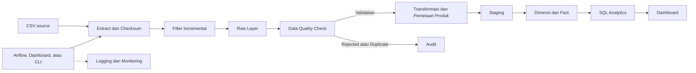
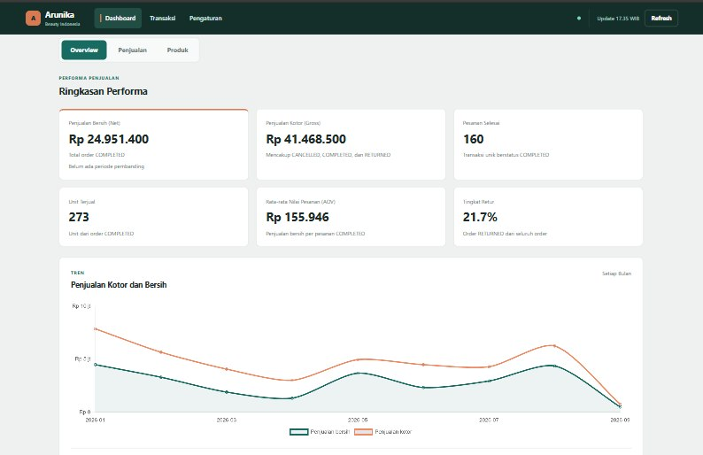
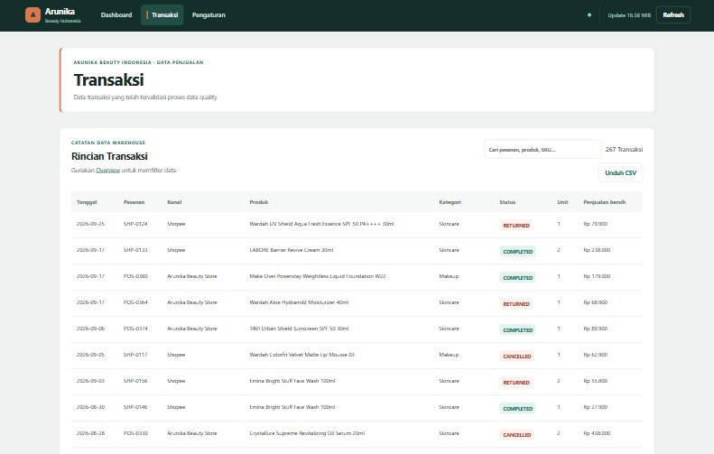
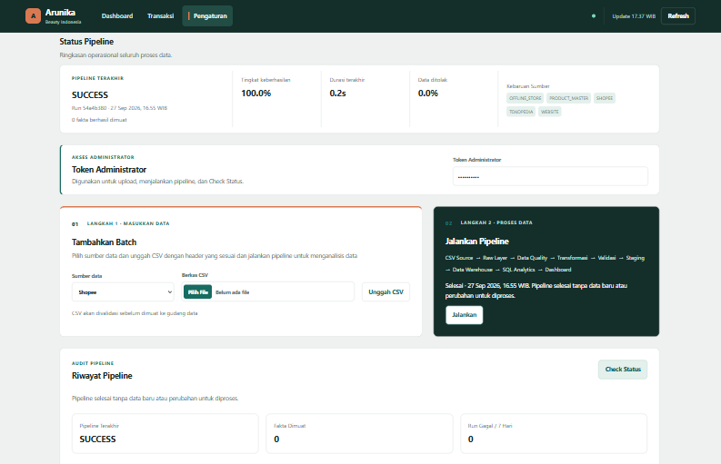

# Arunika Beauty - E-Commerce Sales Data Pipeline

Arunika Beauty E-Commerce Sales Data Pipeline menggabungkan transaksi dari Shopee, Tokopedia, Website, dan toko offline dengan Master Produk sebagai referensi. Data melewati pemeriksaan kualitas dan transformasi sebelum disimpan dalam warehouse berbentuk star schema. Dashboard menyajikan analitik penjualan, sementara Airflow menjadwalkan proses pipeline.

Tujuan proyek ini adalah menyediakan data penjualan yang dapat dipercaya dan ditelusuri: nilai penjualan, kontribusi setiap kanal, produk terlaris, kualitas data sumber, dan status pipeline.

README ini menjelaskan cara menjalankan proyek, alur pipeline, struktur database, asumsi bisnis, dan keputusan teknis. Definisi kolom tersedia di [Kamus Data](docs/data_dictionary.md), sedangkan relasi tabel ditampilkan di [ERD](docs/erd.md).


```mermaid
flowchart LR
    A[CSV source] --> B[Extract dan Checksum]
    B --> C[Filter Incremental]
    C --> D[Raw Layer]
    D --> E[Data Quality Check]
    E -->|Validatian| F[Transformasi dan Pemetaan Produk]
    F --> G[Staging]
    G --> H[Dimensi dan Fact]
    H --> I[SQL Analytics]
    I --> J[Dashboard]
    E -->|Rejected atau Duplicate| K[Audit]
    L[Airflow, Dashboard, atau CLI] --> B
    L -.-> M[Logging dan Monitoring]
```

## Tampilan Dashboard

Dashboard Arunika menyajikan ringkasan KPI, filter periode, analitik penjualan, rincian transaksi, dan pengaturan pipeline. Teal menjadi warna utama, dengan oranye sebagai aksen.

### Ringkasan



### Transaksi



### Pengaturan




## Fitur Utama

- Menggabungkan empat sumber transaksi CSV—Shopee, Tokopedia, Website, dan Offline Store—dengan satu CSV Product Master sebagai referensi.
- Memvalidasi struktur dan isi data sebelum masuk ke warehouse.
- Menyimpan metadata ingestion, hasil validasi, lineage, dan audit pipeline.
- Memuat dimensi dan fact sales ke PostgreSQL star schema.
- Menghindari pemuatan ulang baris yang identik melalui fingerprint/hash.
- Menampilkan KPI penjualan, tren bulanan, kanal, status pesanan, kota, merek, kategori, SKU, dan produk terlaris.
- Menyediakan filter tanggal, kanal, status, kategori, merek, dan produk.
- Menyediakan tabel transaksi dengan pagination dan export CSV.
- Menyediakan pencarian transaksi dan export CSV berdasarkan hasil filter.
- Menyediakan halaman Pengaturan untuk upload CSV, menjalankan pipeline, dan melihat riwayat eksekusi.
- Menampilkan grafik peringkat Produk dengan gradasi teal dan aksen pada peringkat pertama; warna status dan tren tetap membedakan arti metriknya.
- Menjalankan pipeline terjadwal melalui Apache Airflow.
- Mengirim laporan pipeline melalui email jika SMTP dikonfigurasi.

## Stack Teknologi

| Bagian | Teknologi |
| --- | --- |
| Bahasa utama | Python 3.12+ |
| Web dashboard | Flask, HTML, CSS, JavaScript ES modules |
| Web server | Waitress |
| Database | PostgreSQL 16 |
| Akses database | SQLAlchemy, psycopg, asyncpg |
| Transformasi data | pandas |
| Migration | Alembic |
| Orkestrasi | Apache Airflow 3.3 |
| Visualisasi | Chart.js lokal, Plotly untuk analisis |
| Container | Docker dan Docker Compose |
| Pengujian | pytest, browser smoke test berbasis Node.js dan Chromium/Edge |
| Quality tools | Ruff dan pre-commit |
| Zona waktu | `Asia/Jakarta` / WIB |

### Visual Stack

#### Runtime dan Web

<p>
   
   
   
   
</p>

#### Data dan Database

<p>
   
   
   
   
</p>

#### Orkestrasi dan Infrastruktur

<p>
   
   
   
</p>

#### Quality dan Pengujian

<p>
   
   
   
   
</p>


## Arsitektur Proyek

```text
Ecommerce Sales/
|- airflow/                 DAG dan konfigurasi orkestrasi
|- alembic/                 Migration database
|- analisis/                Notebook analisis eksploratif
|- dashboard/               Flask app, template, CSS, JavaScript, dan smoke test
|- data/source/             CSV sumber penjualan dan master produk
|- data/processed/clean/    Hasil export data bersih
|- database/schema/         SQL bootstrap schema PostgreSQL
|- docs/                    Dokumentasi arsitektur, kualitas, ERD, dan runbook
|- pipeline/                Extract, load, transform, reporting, dan validation
|- scripts/                 Pemeriksaan warehouse, freshness, dan kontrak data
|- tests/                   Test suite proyek
|- docker-compose.yml       Service PostgreSQL, pipeline, dashboard, Airflow, dan pgAdmin
```

## Service Docker

`docker compose up -d --build` menyiapkan service berikut:

| Service | Fungsi | Akses lokal |
| --- | --- | --- |
| `postgres` | Database warehouse dan audit | `127.0.0.1:5433` |
| `pipeline` | Migration dan run pipeline awal | Internal Docker |
| `dashboard` | Dashboard Flask untuk analitik dan operasi | `http://127.0.0.1:8501` |
| `airflow-webserver` | UI dan API Airflow | `http://127.0.0.1:8080` |
| `airflow-scheduler` | Menjalankan task sesuai jadwal | Internal Docker |
| `airflow-dag-processor` | Memuat dan memproses DAG | Internal Docker |
| `airflow-init` | Menyiapkan metadata database Airflow | Internal Docker |
| `pgadmin` | Tool opsional untuk inspeksi PostgreSQL | Profile `tools` |

## Prasyarat

Pastikan tersedia:

- Docker Desktop dengan Docker Compose.
- Python 3.12 atau lebih baru untuk menjalankan tool lokal.
- Node.js 22 atau lebih baru untuk browser smoke test.
- Chrome atau Microsoft Edge untuk test browser.
- Git jika proyek diambil dari repository.

Python lokal dapat digunakan untuk menjalankan pengujian dan skrip pemeriksaan tanpa Docker.

## Quick Start dengan Docker

1. Buat file environment dari contoh yang tersedia.

   ```powershell
   Copy-Item .env.example .env
   ```

2. Isi nilai password dan secret di `.env`. Jangan commit file tersebut.

3. Jalankan seluruh service.

   ```powershell
   docker compose up -d --build
   ```

4. Periksa service yang aktif.

   ```powershell
   docker compose ps
   ```

5. Buka aplikasi:

   - Dashboard: `http://127.0.0.1:8501`
   - Airflow: `http://127.0.0.1:8080`

6. Hentikan service jika sudah selesai.

   ```powershell
   docker compose down
   ```

Secara default, PostgreSQL hanya menerima koneksi lokal melalui `127.0.0.1:5433`.

## Konfigurasi Environment

Minimal konfigurasi yang perlu diisi di `.env`:

```env
POSTGRES_DB=ecommerce_sales
POSTGRES_USER=ecommerce_user
POSTGRES_PASSWORD=ganti-dengan-password-kuat
DASHBOARD_ADMIN_TOKEN=ganti-dengan-token-admin
AIRFLOW_ADMIN_USERNAME=admin
AIRFLOW_ADMIN_PASSWORD=ganti-dengan-password-airflow
AIRFLOW_FERNET_KEY=ganti-dengan-fernet-key
AIRFLOW_SECRET_KEY=ganti-dengan-secret-key
APP_TIMEZONE=Asia/Jakarta
```

Konfigurasi email bersifat opsional:

```env
SMTP_HOST=smtp.gmail.com
SMTP_PORT=587
SMTP_USE_TLS=true
SMTP_USERNAME=alamat-pengirim@gmail.com
SMTP_PASSWORD=gmail_app_password
SMTP_FROM=alamat-pengirim@gmail.com
PIPELINE_REPORT_RECIPIENTS=penerima1@gmail.com,penerima2@gmail.com
```

Untuk Gmail, gunakan App Password, bukan password akun Gmail biasa.

## Menggunakan Dashboard

### Ringkasan

Gunakan halaman Ringkasan untuk melihat KPI, tren penjualan, kontribusi channel, status pesanan, kota, brand, kategori, SKU, dan produk terlaris.

1. Pilih periode cepat atau tanggal mulai dan selesai.
2. Pilih filter kanal, status, kategori, merek, atau produk bila diperlukan.
3. Klik **Apply**.
4. Buka tab **Penjualan** atau **Produk** untuk analitik yang lebih spesifik.

### Transaksi

Halaman Transaksi menampilkan baris transaksi sesuai filter terakhir dari Ringkasan. Tersedia pagination dan tombol **Unduh CSV**.

### Pengaturan

Token Administrator diperlukan untuk operasi yang membutuhkan akses admin:

1. Masukkan token pada area **Token Administrator**.
2. Pilih sumber data dan unggah CSV pada Langkah 1.
3. Klik **Jalankan** pada Langkah 2.
4. Gunakan **Check Status** untuk membaca riwayat pipeline.

Token tidak disimpan di `localStorage`; dashboard hanya menggunakannya selama halaman masih terbuka.

## Menjalankan Pipeline secara Manual

Dengan virtual environment repository:

```powershell
.\env\Scripts\python.exe -m pipeline.runner
.\env\Scripts\python.exe .\scripts\check_warehouse.py
```

Periksa freshness source bila diperlukan:

```powershell
.\env\Scripts\python.exe .\scripts\check_freshness.py
```

Hasil run tersimpan di `audit.pipeline_runs` dan `logs/pipeline.log`. Jika SMTP aktif, laporan juga dikirim ke penerima yang dikonfigurasi.

Baris sumber yang sama dengan snapshot sukses sebelumnya dihitung sebagai `skipped_unchanged_records`. Baris tersebut tidak dimuat ulang atau divalidasi kembali.

## Menambahkan Data Baru

Sumber data berada di folder `data/source/`:

```text
data/source/product.csv
data/source/shopee.csv
data/source/tokopedia.csv
data/source/website.csv
data/source/offline.csv
```

CSV dapat ditambahkan melalui dashboard atau ditempatkan langsung di folder sumber. Nama kolom harus sesuai dengan kontrak setiap sumber. Jika header diubah, perbarui extractor dan pengujian yang terkait.

Data di repository hanya untuk simulasi; data tersebut bukan katalog atau harga resmi Arunika.

## Airflow

DAG `ecommerce_sales_pipeline` berada di `airflow/orchestration.py` dan dijadwalkan setiap hari pukul **13.00 WIB** dengan cron berikut:

```text
0 13 * * *
```

Pastikan service `airflow-scheduler` dan `airflow-dag-processor` berjalan. Eksekusi dari terminal, dashboard, dan Airflow memakai komponen pipeline yang sama, sehingga hasilnya tercatat dengan format audit yang konsisten.

## Database dan Migration

Schema PostgreSQL dibagi menjadi beberapa area:

| Schema | Tabel penting | Grain, key, dan fungsi |
| --- | --- | --- |
| `raw` | `shopee_orders`, `tokopedia_transactions`, `website_transactions`, `offline_store_sales`, `product_master` | Satu baris sumber per ingestion. `raw_record_id` adalah PK; `ingestion_run_id` menghubungkan record ke run audit. Nilai sumber dan payload asli disimpan sebelum validasi. |
| `staging` | `stg_sales` | Satu line transaksi canonical yang lolos validasi. `staging_sales_id` adalah PK; kombinasi source, order ID, dan nomor baris menjadi business key. Menyimpan `source_raw_record_id` untuk lineage. |
| `warehouse` | `fact_sales`, `dim_date`, `dim_product`, `dim_customer`, `dim_channel`, `dim_payment` | Star schema untuk analitik. Grain fact adalah satu produk pada satu transaksi source. `sales_key` adalah PK; `date_key`, `product_key`, `customer_key`, `channel_key`, dan `payment_key` adalah FK. Business key fact adalah `(source_name, source_order_id, source_line_number)`. |
| `audit` | `pipeline_runs`, `pipeline_stage_runs`, `source_ingestions`, `source_snapshots`, `data_quality_results`, `rejected_records`, `pipeline_watermarks` | Satu baris per run, tahap, source, rule, record rejected, atau snapshot sesuai fungsi tabel. Menyimpan hasil operasional, durasi, kualitas, dan jejak incremental. |

Pada staging, `source_raw_record_id` adalah referensi lineage yang dijaga pipeline; foreign key warehouse ke seluruh dimensi ditegakkan oleh PostgreSQL. Detail PK, FK, tipe kolom, dan grain setiap tabel ada pada [Kamus Data](docs/data_dictionary.md).

SQL dalam `database/schema/` digunakan saat volume PostgreSQL baru dibuat. Untuk database yang sudah ada, jalankan migration:

```powershell
.\env\Scripts\python.exe -m alembic upgrade head
```

## Keputusan Teknis dan Asumsi Bisnis

### Keputusan teknis

- PostgreSQL memakai empat schema: `raw`, `staging`, `warehouse`, dan `audit`.
- Raw adalah landing layer: payload source baru/berubah dipersist sebelum quality check atau transformasi.
- Incremental loading memakai checksum file dan payload hash per baris. Run tanpa perubahan berhenti setelah pemeriksaan snapshot; pipeline tidak mengulang quality check atau load downstream.
- Pencarian fact untuk mendeteksi transaksi baru atau koreksi dibatasi pada business key kandidat run saat ini, bukan membaca seluruh fact ke memori. `source_record_hash` membedakan transaksi identik dari koreksi.
- Warehouse menggunakan star schema dengan `fact_sales` sebagai fact utama dan dimensi tanggal, produk, customer, channel, serta pembayaran.
- Alembic mengelola perubahan schema melalui migration, sehingga pembaruan database tidak memerlukan penghapusan Docker volume.
- Semua waktu aplikasi, audit, dashboard, dan Airflow memakai WIB (`Asia/Jakarta`).

### Asumsi bisnis

- Grain `fact_sales` adalah satu produk pada satu transaksi source. Source sample saat ini umumnya satu produk per order sehingga `source_line_number = 1`.
- Business key transaksi memakai `(source_name, source_order_id, source_line_number)` karena ID order dapat berulang antar-kanal. Source saat ini belum menyediakan line ID stabil, sehingga nomor baris transaksi canonical ditetapkan `1`.
- Penjualan bersih dashboard adalah `net_amount` dengan status `COMPLETED` saja.
- Penjualan kotor dashboard adalah `gross_amount` seluruh status: `CANCELLED`, `COMPLETED`, dan `RETURNED`.
- Source belum menyediakan diskon; `discount_amount` saat ini bernilai nol dan `net_amount` setara gross pada order yang sama.
- Transaksi yang hilang dari file source tidak dihapus otomatis dari warehouse. Koreksi dengan business key sama dan hash berbeda di-upsert.
- CSV dalam repository adalah data sample/simulasi, bukan data operasional atau harga resmi.

## SQL Analytics dan Laporan Kualitas

View SQL yang menjadi sumber analitik tersedia di PostgreSQL:

```text
warehouse.v_sales_detail
warehouse.v_sales_kpi
warehouse.v_sales_monthly_kpi
warehouse.v_sales_channel_kpi
warehouse.v_top_product_kpi
warehouse.v_sales_status_kpi
audit.v_data_quality_by_rule
audit.v_data_quality_report
```

Endpoint Overview memakai agregasi SQL pada `warehouse.v_sales_detail` sesuai filter yang dipilih pengguna. PostgreSQL menghitung gross sales, net sales, return rate, AOV, tren bulanan, kontribusi kanal, produk, status, kategori, kota, merek, dan SKU. Python menyajikan hasil query tersebut ke dashboard dan menyediakan rincian transaksi.

Grafik peringkat Produk membedakan posisi teratas dengan aksen dan memakai gradasi teal untuk bar lainnya. Perbedaan warna tersebut hanya membantu membaca urutan; ukuran bar tetap menunjukkan nilai penjualan bersih.

Contoh KPI utama:

```sql
SELECT * FROM warehouse.v_sales_kpi;
SELECT * FROM warehouse.v_sales_monthly_kpi ORDER BY month_start;
SELECT * FROM warehouse.v_sales_channel_kpi ORDER BY net_sales_completed DESC;
SELECT * FROM warehouse.v_top_product_kpi ORDER BY net_sales_completed DESC LIMIT 10;
```

Laporan pemeriksaan kualitas untuk setiap sumber dan aturan pada run terbaru:

```powershell
.\env\Scripts\python.exe .\scripts\report_data_quality.py
```

Dokumentasi rule dan perlakuannya ada di [Kualitas Data](docs/data_quality.md). ERD dan definisi field tersedia di [ERD](docs/erd.md) serta [Kamus Data](docs/data_dictionary.md).

## Pengujian dan Quality Check

Test biasa:

```powershell
.\env\Scripts\python.exe .\tests\main.py
```

Test lengkap, termasuk PostgreSQL terisolasi dan browser smoke test:

```powershell
.\env\Scripts\python.exe .\tests\main.py --full
```

Smoke test dashboard saja:

```powershell
node dashboard/tests/browser_smoke.mjs
```

Smoke test mencakup viewport 320 sampai 1440 piksel, navigasi, tab analitik, kartu mobile, filter, pagination, upload, pipeline, riwayat, pemulihan API, dan fallback chart.

Pemeriksaan tambahan:

```powershell
.\env\Scripts\python.exe .\scripts\check_clean_contract.py
.\env\Scripts\python.exe .\scripts\check_freshness.py
.\env\Scripts\python.exe .\scripts\check_warehouse.py
```

Test menggunakan database `ecommerce_sales_test` yang terpisah dari warehouse development, tidak mengubah source utama, dan tidak mengirim email.

## Analisis dan Export Data Bersih

Jalankan analisis validasi dengan:

```powershell
.\env\Scripts\python.exe -m pipeline.validation.analysis
```

Hasil export tersedia di `data/processed/clean/`. Notebook eksplorasi berada di folder `analisis/` dan tidak menjadi bagian dari runtime dashboard.


## Dokumentasi Lanjutan

- [Panduan Analisis Data](analisis/README.md)
- [Panduan Database](database/README.md) 
- [Arsitektur Sistem](docs/architecture.md)
- [Kualitas Data](docs/data_quality.md)
- [Kamus Data](docs/data_dictionary.md)
- [ERD](docs/erd.md)
- [Technical Runbook](docs/technical_runbook.md)
- [Database Schema](database/README.md)
- [Dashboard dan UI/UX](dashboard/README.md)

## Catatan Proyek

Arunika Beauty E-Commerce Sales Data Pipeline dirancang sebagai proyek pembelajaran dan operasional internal. Fokusnya bukan hanya membuat grafik, tetapi membangun jalur data yang dapat ditelusuri: source dapat divalidasi, transformasi dapat diaudit, warehouse dapat diperiksa, dan hasil analitik dapat digunakan kembali oleh dashboard maupun laporan pipeline.
