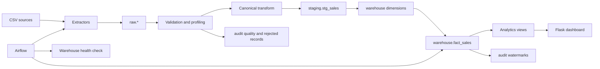

# Architecture

## End-to-end flow



## Layers

| Layer | Owner | Responsibility |
| --- | --- | --- |
| Source | `data/source` | CSV snapshots with intentionally imperfect data |
| Extract | `pipeline/extract` | Read source-specific files and capture checksum/lineage |
| Raw | PostgreSQL `raw` | Preserve source fields and payload before transformation |
| Validation | `pipeline/validation` | Detect missing, duplicate, invalid, date, type, and product issues |
| Transform | `pipeline/transform` | Produce canonical rows and filter existing business keys |
| Staging | PostgreSQL `staging.stg_sales` | Hold validated rows before dimension key resolution |
| Warehouse | PostgreSQL `warehouse` | Star schema for analytical workloads |
| Audit | PostgreSQL `audit` | Run status, quality evidence, rejected records, and watermarks |
| Presentation | `dashboard` | Flask API and browser dashboard over analytics views |

## Incremental strategy

The source snapshot is validated on every run so quality metrics remain current.
At the raw boundary, rows already stored for the same source file and source row
number are skipped. This makes append-only source snapshots incremental before
clean rows are filtered by the warehouse business key
`(source_name, source_order_id, source_line_number)`. Keys already present in
`warehouse.fact_sales` are skipped. New rows only are inserted into staging and
fact; the unique fact constraint is the final duplicate guard.

This provides both incremental processing and idempotency. A source correction
using an existing business key is intentionally not silently overwritten; it
requires a correction policy or a new line/version key.

## Warehouse design

`warehouse.fact_sales` has one row per source order line. Product, date, customer,
channel, and payment are dimensions. Surrogate keys are used for joins, while
source identifiers remain in the fact for traceability. `gross_amount` is
`quantity * unit_price`; discount is currently zero because source contracts do
not provide a validated discount field.

## Operational commands

```powershell
docker compose up -d
.\env\Scripts\python.exe -m pipeline.runner
.\env\Scripts\python.exe .\scripts\check_warehouse.py
.\env\Scripts\python.exe dashboard\flask.py
```

Airflow runs the same runner and then the warehouse health check. On Windows,
Airflow should run through Docker or WSL2 rather than the native Python runtime.
