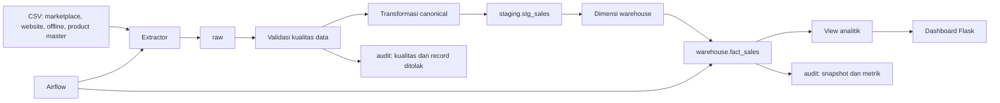

# Arsitektur Pipeline

## Alur data



## Fungsi setiap layer

| Layer | Lokasi | Fungsi |
| --- | --- | --- |
| Source | `data/source/` | CSV asli dari setiap channel. |
| Extract | `pipeline/extract/` | Membaca source, checksum, dan nomor baris. |
| Raw | `raw` | Menyimpan payload source baru atau berubah. |
| Validation | `pipeline/validation/` | Memeriksa missing value, duplikat, nilai, tanggal, tipe, dan produk. |
| Transform | `pipeline/transform/` | Menyamakan kolom dan memetakan produk ke SKU. |
| Staging | `staging.stg_sales` | Menyimpan record valid sebelum key warehouse diisi. |
| Warehouse | `warehouse` | Star schema untuk analitik. |
| Audit | `audit` | Menyimpan run, stage, kualitas, snapshot, dan lineage. |
| Dashboard | `dashboard/` | Menyajikan analitik dan operasi admin terbatas. |

## Incremental loading

Setiap run membaca fingerprint source. Baris yang sama dengan snapshot sebelumnya dilewati sebelum validasi. Hanya baris baru atau yang berubah masuk ke raw, staging, dan warehouse.

Business key fact:

```text
(source_name, source_order_id, source_line_number)
```

`source_record_hash` membedakan transaksi yang benar-benar berubah. Constraint unik pada fact menjadi perlindungan terakhir terhadap duplikat. Transaksi yang hilang dari snapshot tidak dihapus otomatis.

## Warehouse dan operasional

Grain `warehouse.fact_sales` adalah satu produk dalam satu transaksi source. Fact terhubung ke dimensi tanggal, produk, pelanggan, channel, dan pembayaran. `gross_amount` dihitung dari `quantity × unit_price`.

Airflow menjalankan pipeline dan health check setiap hari pukul 13.00 WIB. Pada Windows, gunakan Docker atau WSL2 untuk Airflow.

```powershell
docker compose up -d
.\env\Scripts\python.exe -m pipeline.runner
.\env\Scripts\python.exe .\scripts\check_warehouse.py
```
