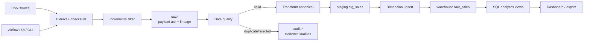

# Arsitektur dan Lineage Pipeline

Dokumen ini menjelaskan perjalanan record dari CSV sampai menjadi analitik. Seluruh waktu operasional menggunakan `Asia/Jakarta` atau WIB.

## Alur fisik data


```mermaid
flowchart LR
    A[CSV source] --> B[Extract + checksum]
    B --> C[Incremental filter]
    C --> D[raw.*\npayload asli + lineage]
    D --> E[Data quality]
    E -->|valid| F[Transform canonical]
    E -->|duplicate/rejected| G[audit.*\nevidence kualitas]
    F --> H[staging.stg_sales]
    H --> I[Dimension upsert]
    I --> J[warehouse.fact_sales]
    J --> K[SQL analytics views]
    K --> L[Dashboard / export]
    M[Airflow / UI / CLI] --> B
```

Dashboard memakai `warehouse.v_sales_detail` sebagai sumber data terfilter. KPI dan chart dihitung dengan agregasi SQL di PostgreSQL, sehingga metrik UI tidak dihitung ulang melalui loop Python. View KPI tanpa filter (`v_sales_kpi`, `v_sales_monthly_kpi`, `v_sales_channel_kpi`, `v_top_product_kpi`, dan `v_sales_status_kpi`) tetap tersedia untuk reviewer dan tool BI.

`raw.*` adalah landing layer. Setiap baris baru atau berubah dipersist lebih dahulu tanpa mengubah nilai source. Record invalid tetap dapat ditelusuri melalui raw, `audit.data_quality_results`, dan `audit.rejected_records`, tetapi tidak boleh masuk staging atau fact.

## Kontrak tiap tahap

| Tahap | Input | Output | Bukti lineage |
| --- | --- | --- | --- |
| Extract | CSV source | frame source, checksum, nomor baris | checksum SHA-256 dan `source_row_number` |
| Incremental | frame source + snapshot sukses terakhir | hanya payload baru/berubah | `audit.source_snapshots.payload_hashes` |
| Raw load | payload source asli | `raw.*` | `ingestion_run_id`, file, baris, JSON payload |
| Validation | raw-equivalent delta | valid, duplicate, rejected | rule, severity, alasan, payload rejected |
| Transform | record valid | schema canonical | tanggal typed, SKU mapped, customer natural key |
| Staging | canonical row | `staging.stg_sales` | `source_raw_record_id`, hash record |
| Warehouse | staging | dimensions dan `fact_sales` | surrogate key serta business key source |
| Analytics | fact/dimension | SQL views dan dashboard | query view PostgreSQL |

## Transformasi utama

1. Nama kolom source berbeda dipetakan ke field canonical seperti `order_id`, `order_date`, `product_name`, `quantity`, `unit_price`, dan `status`.
2. Teks dinormalisasi dengan Unicode NFKC, whitespace konsisten, dan identifier disimpan sebagai string agar leading zero tidak hilang.
3. Tanggal diparse sesuai kontrak masing-masing source lalu disimpan sebagai `DATE`.
4. Quantity menjadi integer positif dan uang menjadi nilai `NUMERIC`/`Decimal`.
5. Nama atau SKU produk dipetakan ke Product Master untuk memperoleh `mapped_sku`, brand, dan kategori.
6. Customer email atau nama/kota dibentuk menjadi customer natural key yang aman untuk dimensi.
7. Record valid masuk `staging.stg_sales`; dimension loader menyelesaikan surrogate key; fact loader melakukan insert atau koreksi berdasarkan business key dan hash.

## Incremental loading

Pipeline membandingkan payload hash sumber dengan snapshot dari run sukses terakhir.

```text
Payload identik                 → dilewati sebelum validasi dan raw load
Payload baru                    → raw → validation → staging → warehouse
Business key sama, hash berubah → koreksi/upsert warehouse
Business key dan hash sama      → tidak menulis fact ulang
Baris hilang dari source        → tidak dihapus otomatis
```

Jika seluruh payload pada semua source, termasuk Product Master, identik, run ditutup dengan status `SUCCESS` segera setelah `snapshot_lookup`, `source_scan`, dan `incremental_extract`. Pada jalur ini tidak ada stage `raw_load`, `validate`, `transform`, `staging_load`, `dimension_load`, atau `fact_load`; laporan run mencatat seluruh metrik pemrosesan sebagai `0` dan menjelaskan bahwa tidak ada data baru atau perubahan.

Business key fact adalah:

```text
(source_name, source_order_id, source_line_number)
```

`source_record_hash` memastikan koreksi tidak tertukar dengan transaksi identik lama. Lihat [`docs/data_quality.md`](data_quality.md) untuk aturan validasi dan [`docs/erd.md`](erd.md) untuk relasi database.

Contoh pembacaan yang benar:

```text
Run 1: source berisi 100 transaksi → 100 kandidat baru → 100 valid → 100 fact dimuat.
Run 2: source berisi 120 transaksi → hanya 20 kandidat baru/berubah diproses.
```

Run 2 tidak memvalidasi atau memuat ulang 100 transaksi lama. Jika tidak ada kandidat baru sama sekali, quality check, staging, dan warehouse tidak dijalankan ulang. Narasi run disimpan pada `audit.pipeline_runs.outcome_message`, ditulis ke structured log, dan dikirim dalam laporan email.
