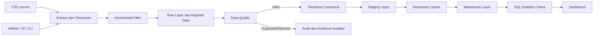

# Arsitektur dan Lineage Pipeline

Dokumen ini menjelaskan alur data dari CSV hingga tampil sebagai analitik. Waktu pada pipeline, dashboard, dan audit menggunakan zona waktu `Asia/Jakarta` (WIB).

## Alur fisik data


```mermaid
flowchart LR
    A[CSV source] --> B[Extract dan Checksum]
    B --> C[Incremental Filter]
    C --> D[Raw Layer dan Payload Data]
    D --> E[Data Quality]
    E -->|Valid| F[Transform Canonical]
    E -->|Duplicate/Rejected| G[Audit dan Evidence Kualitas]
    F --> H[Staging Layer]
    H --> I[Dimension Upsert]
    I --> J[Warehouse Layer]
    J --> K[SQL Analytics Views]
    K --> L[Dashboard]
    M[Airflow / UI / CLI] --> B
```

Dashboard menggunakan `warehouse.v_sales_detail` untuk menyajikan data sesuai filter. PostgreSQL menghitung KPI dan grafik melalui agregasi SQL. View KPI tanpa filter (`v_sales_kpi`, `v_sales_monthly_kpi`, `v_sales_channel_kpi`, `v_top_product_kpi`, dan `v_sales_status_kpi`) juga tersedia untuk pemeriksaan dan kebutuhan BI.

`raw.*` menjadi tempat penyimpanan awal. Setiap baris baru atau berubah disimpan terlebih dahulu tanpa mengubah nilai dari sumbernya. Baris yang tidak lolos validasi tetap dapat ditelusuri di raw dan tabel audit, tetapi tidak diteruskan ke staging atau fact.

## Kontrak tiap tahap

| Tahap | Input | Output | Bukti lineage |
| --- | --- | --- | --- |
| Extract | CSV source | frame source, checksum, nomor baris | checksum SHA-256 dan `source_row_number` |
| Incremental | frame source + snapshot sukses terakhir | hanya payload baru/berubah | `audit.source_snapshots.payload_hashes` |
| Raw load | payload source asli | `raw.*` | `ingestion_run_id`, file, baris, JSON payload |
| Validation | raw-equivalent delta | valid, duplicate, rejected | rule, severity, alasan, payload rejected |
| Transform | record valid | schema canonical | tanggal typed, SKU mapped, customer natural key |
| Staging | canonical row | `staging.stg_sales` | `source_raw_record_id`, hash record |
| Warehouse | staging | dimensions dan `fact_sales` | surrogate key serta business key source |
| Analytics | fact/dimension | SQL views dan dashboard | query view PostgreSQL |

### Lookup fact incremental

Setelah quality check menghasilkan kandidat valid, pipeline mengambil business key kandidat run tersebut dan mencari kecocokan hanya untuk key itu di `warehouse.fact_sales`. Pipeline tidak memuat seluruh tabel fact ke memori dan tidak menjalankan `COUNT(*)` atas seluruh fact sebelum dan sesudah load. Hash yang ditemukan dibandingkan dengan `source_record_hash` untuk membedakan record identik dari koreksi; jumlah insert baru dihitung dari kandidat yang key-nya belum ada.

Biaya lookup ini mengikuti jumlah kandidat valid pada run saat ini, bukan jumlah seluruh transaksi historis di warehouse. Run tanpa perubahan tetap selesai pada pemeriksaan snapshot dan tidak menjalankan lookup fact.

## Transformasi utama

1. Nama kolom dari setiap sumber dipetakan ke kolom standar seperti `order_id`, `order_date`, `product_name`, `quantity`, `unit_price`, dan `status`.
2. Teks dinormalisasi dengan Unicode NFKC, whitespace konsisten, dan identifier disimpan sebagai string agar leading zero tidak hilang.
3. Tanggal diparse sesuai kontrak masing-masing source lalu disimpan sebagai `DATE`.
4. Quantity menjadi integer positif dan uang menjadi nilai `NUMERIC`/`Decimal`.
5. Nama atau SKU produk dicocokkan dengan Product Master untuk memperoleh `mapped_sku`, merek, dan kategori.
6. Email pelanggan atau kombinasi nama dan kota digunakan untuk membentuk natural key pelanggan pada dimensi.
7. Baris yang lolos validasi dimuat ke `staging.stg_sales`. Pipeline kemudian menentukan surrogate key dimensi dan memuat atau memperbarui fact berdasarkan business key dan hash.

## Incremental loading

Pipeline membandingkan hash payload dengan snapshot dari run sukses terakhir.

```text
Payload identik                 → dilewati sebelum validasi dan raw load
Payload baru                    → raw → validation → staging → warehouse
Business key sama, hash berubah → koreksi/upsert warehouse
Business key dan hash sama      → tidak menulis fact ulang
Baris hilang dari source        → tidak dihapus otomatis
```

Jika seluruh payload pada semua source, termasuk Product Master, identik, run ditutup dengan status `SUCCESS` segera setelah `snapshot_lookup`, `source_scan`, dan `incremental_extract`. Pada jalur ini tidak ada stage `raw_load`, `validate`, `transform`, `staging_load`, `dimension_load`, atau `fact_load`; laporan run mencatat seluruh metrik pemrosesan sebagai `0` dan menjelaskan bahwa tidak ada data baru atau perubahan.

Business key fact adalah:

```text
(source_name, source_order_id, source_line_number)
```

`source_record_hash` memastikan koreksi tidak tertukar dengan transaksi identik lama. Lihat [`docs/data_quality.md`](data_quality.md) untuk aturan validasi dan [`docs/erd.md`](erd.md) untuk relasi database.

Contoh pembacaan yang benar:

```text
Run 1: source berisi 100 transaksi → 100 kandidat baru → 100 valid → 100 fact dimuat.
Run 2: source berisi 120 transaksi → hanya 20 kandidat baru/berubah diproses.
```

Run 2 tidak memvalidasi atau memuat ulang 100 transaksi lama. Jika tidak ada kandidat baru, pemeriksaan kualitas, staging, dan pemuatan warehouse dilewati. Ringkasan run disimpan di `audit.pipeline_runs.outcome_message`, dicatat pada log, dan disertakan dalam email laporan.
