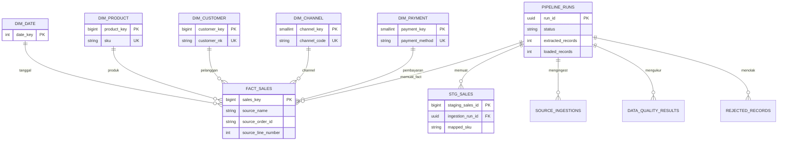

# Diagram Relasi Entitas

`FACT_SALES` menyimpan satu produk dalam satu transaksi source. Source saat ini umumnya memiliki satu item per order sehingga `source_line_number` bernilai `1`. Kolom ini dipertahankan agar model siap menerima transaksi multi-item.

Dimensi memakai surrogate key agar join stabil. Identifier source tetap disimpan pada fact untuk audit, lineage, dan incremental loading.
