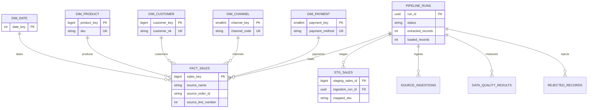

# Entity Relationship Diagram

The fact grain is one source order line. Since current sources provide one item
per order, `source_line_number` is always `1`; it is retained so the model can
support multi-line orders when a stable source line identifier becomes available.
Surrogate dimension keys keep joins compact and stable, while source order keys
remain on the fact for auditability and incremental duplicate prevention.
