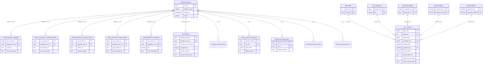

# ERD Warehouse dan Audit

Diagram ini menunjukkan PK, FK, serta relasi data utama. Notasi `PK` berarti primary key, `FK` berarti foreign key, dan `UK` berarti unique key.

```mermaid
erDiagram
    PIPELINE_RUNS ||--o{ RAW_SHOPEE_ORDERS : ingestion_run_id
    PIPELINE_RUNS ||--o{ RAW_TOKOPEDIA_TRANSACTIONS : ingestion_run_id
    PIPELINE_RUNS ||--o{ RAW_WEBSITE_TRANSACTIONS : ingestion_run_id
    PIPELINE_RUNS ||--o{ RAW_OFFLINE_STORE_SALES : ingestion_run_id
    PIPELINE_RUNS ||--o{ RAW_PRODUCT_MASTER : ingestion_run_id
    PIPELINE_RUNS ||--o{ STG_SALES : ingestion_run_id
    PIPELINE_RUNS ||--o{ SOURCE_INGESTIONS : run_id
    PIPELINE_RUNS ||--o{ DATA_QUALITY_RESULTS : run_id
    PIPELINE_RUNS ||--o{ REJECTED_RECORDS : run_id
    PIPELINE_RUNS ||--o{ PIPELINE_STAGE_RUNS : run_id
    PIPELINE_RUNS ||--o{ SOURCE_SNAPSHOTS : run_id

    DIM_DATE ||--o{ FACT_SALES : date_key
    DIM_PRODUCT ||--o{ FACT_SALES : product_key
    DIM_CUSTOMER ||--o{ FACT_SALES : customer_key
    DIM_CHANNEL ||--o{ FACT_SALES : channel_key
    DIM_PAYMENT ||--o{ FACT_SALES : payment_key

    PIPELINE_RUNS {
        uuid run_id PK
        varchar pipeline_name
        timestamptz started_at
        varchar status
    }
    RAW_SHOPEE_ORDERS {
        bigint raw_record_id PK
        uuid ingestion_run_id FK
        text order_id
        text source_payload
    }
    RAW_TOKOPEDIA_TRANSACTIONS {
        bigint raw_record_id PK
        uuid ingestion_run_id FK
        text transaction_id
        text source_payload
    }
    RAW_WEBSITE_TRANSACTIONS {
        bigint raw_record_id PK
        uuid ingestion_run_id FK
        text invoice_no
        text source_payload
    }
    RAW_OFFLINE_STORE_SALES {
        bigint raw_record_id PK
        uuid ingestion_run_id FK
        text pos_receipt_no
        text source_payload
    }
    RAW_PRODUCT_MASTER {
        bigint raw_record_id PK
        uuid ingestion_run_id FK
        varchar sku
        text source_payload
    }
    STG_SALES {
        bigint staging_sales_id PK
        uuid ingestion_run_id FK
        bigint source_raw_record_id
        varchar mapped_sku
        text source_order_id
        char source_record_hash
    }
    DIM_DATE {
        int date_key PK
        date full_date UK
    }
    DIM_PRODUCT {
        bigint product_key PK
        varchar sku UK
    }
    DIM_CUSTOMER {
        bigint customer_key PK
        text customer_nk UK
    }
    DIM_CHANNEL {
        smallint channel_key PK
        varchar channel_code UK
    }
    DIM_PAYMENT {
        smallint payment_key PK
        varchar payment_method UK
    }
    FACT_SALES {
        bigint sales_key PK
        int date_key FK
        bigint product_key FK
        bigint customer_key FK
        smallint channel_key FK
        smallint payment_key FK
        varchar source_name
        text source_order_id
        int source_line_number
        char source_record_hash
    }
    DATA_QUALITY_RESULTS {
        bigint quality_result_id PK
        uuid run_id FK
        varchar rule_name
        int failed_records
    }
    REJECTED_RECORDS {
        bigint rejected_record_id PK
        uuid run_id FK
        text rejection_reason
    }
```

## Grain tabel

| Tabel | Grain / satu baris merepresentasikan |
| --- | --- |
| `raw.shopee_orders` | Satu baris mentah CSV Shopee dalam satu ingestion run. |
| `raw.tokopedia_transactions` | Satu baris mentah CSV Tokopedia dalam satu ingestion run. |
| `raw.website_transactions` | Satu baris mentah CSV Website dalam satu ingestion run. |
| `raw.offline_store_sales` | Satu baris mentah CSV toko offline dalam satu ingestion run. |
| `raw.product_master` | Satu baris master produk dalam satu ingestion run. |
| `staging.stg_sales` | Satu line item transaksi canonical yang valid. |
| `warehouse.fact_sales` | Satu produk dalam satu transaksi source. Business key: `(source_name, source_order_id, source_line_number)`. |
| `warehouse.dim_date` | Satu tanggal kalender. |
| `warehouse.dim_product` | Satu SKU produk canonical. |
| `warehouse.dim_customer` | Satu customer natural key per source. |
| `warehouse.dim_channel` | Satu channel penjualan. |
| `warehouse.dim_payment` | Satu metode pembayaran canonical. |
| `audit.pipeline_runs` | Satu eksekusi pipeline. |
| `audit.data_quality_results` | Satu rule kualitas per source per run. |
| `audit.rejected_records` | Satu record yang ditolak pada satu run. |
| `audit.source_snapshots` | Snapshot terakhir satu source untuk incremental loading. |

`source_raw_record_id` pada staging adalah referensi lineage aplikasi ke raw record yang dipilih pada run yang sama. Relasi database yang dipaksa dengan foreign key berada pada `ingestion_run_id` dan seluruh foreign key fact ke dimensi.
