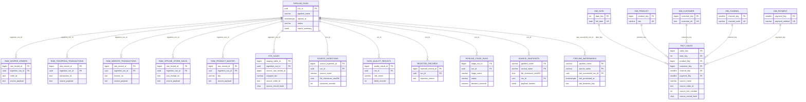

# ERD Warehouse dan Audit

Diagram berikut merangkum tabel dan relasi utama. `PK` menandai primary key, `FK` menandai foreign key, dan `UK` menandai unique key.

```mermaid
erDiagram
    PIPELINE_RUNS ||--o{ RAW_SHOPEE_ORDERS : ingestion_run_id
    PIPELINE_RUNS ||--o{ RAW_TOKOPEDIA_TRANSACTIONS : ingestion_run_id
    PIPELINE_RUNS ||--o{ RAW_WEBSITE_TRANSACTIONS : ingestion_run_id
    PIPELINE_RUNS ||--o{ RAW_OFFLINE_STORE_SALES : ingestion_run_id
    PIPELINE_RUNS ||--o{ RAW_PRODUCT_MASTER : ingestion_run_id
    PIPELINE_RUNS ||--o{ STG_SALES : ingestion_run_id
    PIPELINE_RUNS ||--o{ SOURCE_INGESTIONS : run_id
    PIPELINE_RUNS ||--o{ DATA_QUALITY_RESULTS : run_id
    PIPELINE_RUNS ||--o{ REJECTED_RECORDS : run_id
    PIPELINE_RUNS ||--o{ PIPELINE_STAGE_RUNS : run_id
    PIPELINE_RUNS ||--o{ SOURCE_SNAPSHOTS : run_id
    PIPELINE_RUNS ||--o{ PIPELINE_WATERMARKS : last_successful_run_id

    DIM_DATE ||--o{ FACT_SALES : date_key
    DIM_PRODUCT ||--o{ FACT_SALES : product_key
    DIM_CUSTOMER ||--o{ FACT_SALES : customer_key
    DIM_CHANNEL ||--o{ FACT_SALES : channel_key
    DIM_PAYMENT ||--o{ FACT_SALES : payment_key

    PIPELINE_RUNS {
        uuid run_id PK
        varchar pipeline_name
        timestamptz started_at
        varchar status
        jsonb report_summary
    }
    RAW_SHOPEE_ORDERS {
        bigint raw_record_id PK
        uuid ingestion_run_id FK
        text order_id
        text source_payload
    }
    RAW_TOKOPEDIA_TRANSACTIONS {
        bigint raw_record_id PK
        uuid ingestion_run_id FK
        text transaction_id
        text source_payload
    }
    RAW_WEBSITE_TRANSACTIONS {
        bigint raw_record_id PK
        uuid ingestion_run_id FK
        text invoice_no
        text source_payload
    }
    RAW_OFFLINE_STORE_SALES {
        bigint raw_record_id PK
        uuid ingestion_run_id FK
        text pos_receipt_no
        text source_payload
    }
    RAW_PRODUCT_MASTER {
        bigint raw_record_id PK
        uuid ingestion_run_id FK
        varchar sku
        text source_payload
    }
    STG_SALES {
        bigint staging_sales_id PK
        uuid ingestion_run_id FK
        bigint source_raw_record_id
        varchar mapped_sku
        text source_order_id
        char source_record_hash
    }
    DIM_DATE {
        int date_key PK
        date full_date UK
    }
    DIM_PRODUCT {
        bigint product_key PK
        varchar sku UK
    }
    DIM_CUSTOMER {
        bigint customer_key PK
        text customer_nk UK
    }
    DIM_CHANNEL {
        smallint channel_key PK
        varchar channel_code UK
    }
    DIM_PAYMENT {
        smallint payment_key PK
        varchar payment_method UK
    }
    FACT_SALES {
        bigint sales_key PK
        int date_key FK
        bigint product_key FK
        bigint customer_key FK
        smallint channel_key FK
        smallint payment_key FK
        varchar source_name
        text source_order_id
        int source_line_number
        char source_record_hash
    }
    DATA_QUALITY_RESULTS {
        bigint quality_result_id PK
        uuid run_id FK
        varchar rule_name
        int failed_records
    }
    REJECTED_RECORDS {
        bigint rejected_record_id PK
        uuid run_id FK
        text rejection_reason
    }
    SOURCE_INGESTIONS {
        bigint source_ingestion_id PK
        uuid run_id FK
        varchar source_name
        char file_checksum_sha256
        int extracted_records
    }
    PIPELINE_STAGE_RUNS {
        bigint stage_run_id PK
        uuid run_id FK
        varchar stage_name
        varchar status
        numeric duration_seconds
    }
    SOURCE_SNAPSHOTS {
        varchar pipeline_name PK
        varchar source_name PK
        char file_checksum_sha256
        uuid run_id FK
        jsonb payload_hashes
    }
    PIPELINE_WATERMARKS {
        varchar pipeline_name PK
        varchar source_name PK
        uuid last_successful_run_id FK
        timestamptz last_processed_at
        text last_business_key
    }
```

## Analytics Views

View berikut adalah objek baca saja. View tidak ditampilkan sebagai tabel pada ERD karena tidak menyimpan data sendiri; semuanya dibentuk dari tabel Warehouse dan Audit.

| View | Sumber data utama | Kegunaan |
| --- | --- | --- |
| `warehouse.v_sales_detail` | `fact_sales` dan seluruh dimensi terkait | Dataset transaksi canonical untuk dashboard, filter, tabel rincian transaksi, dan ekspor CSV. |
| `warehouse.v_sales_by_month` | `fact_sales`, `dim_date` | Agregasi penjualan, unit, dan nilai gross/net per bulan serta status. |
| `warehouse.v_sales_by_channel` | `fact_sales`, `dim_channel` | Agregasi penjualan per kanal dan status. |
| `warehouse.v_sales_by_product` | `fact_sales`, `dim_product` | Agregasi penjualan per produk, brand, kategori, dan status. |
| `warehouse.v_sales_kpi` | `fact_sales` | KPI keseluruhan: gross sales, net sales, completed order, returned order, unit terjual, return rate, dan AOV. |
| `warehouse.v_sales_monthly_kpi` | `fact_sales`, `dim_date` | KPI utama yang dikelompokkan per bulan. |
| `warehouse.v_sales_channel_kpi` | `fact_sales`, `dim_channel` | KPI utama yang dikelompokkan per kanal penjualan. |
| `warehouse.v_top_product_kpi` | `fact_sales`, `dim_product` | Dasar analisis produk teratas berdasarkan penjualan dan unit order COMPLETED. |
| `warehouse.v_sales_status_kpi` | `fact_sales` | Jumlah order, unit, gross sales, dan net sales per status transaksi. |
| `warehouse.v_pipeline_quality` | `audit.pipeline_runs`, `audit.data_quality_results` | Ringkasan kualitas dan metrik setiap eksekusi pipeline. |
| `audit.v_data_quality_by_rule` | `audit.pipeline_runs`, `audit.data_quality_results` | Bukti quality check per run, source, dan aturan validasi. |
| `audit.v_data_quality_report` | `audit.pipeline_runs`, `audit.data_quality_results` | Laporan kualitas per run dan source: missing value, duplicate, invalid value, invalid date, status, serta product mapping. |

## Grain tabel

| Tabel | Grain / satu baris merepresentasikan |
| --- | --- |
| `raw.shopee_orders` | Satu baris mentah CSV Shopee dalam satu ingestion run. |
| `raw.tokopedia_transactions` | Satu baris mentah CSV Tokopedia dalam satu ingestion run. |
| `raw.website_transactions` | Satu baris mentah CSV Website dalam satu ingestion run. |
| `raw.offline_store_sales` | Satu baris mentah CSV toko offline dalam satu ingestion run. |
| `raw.product_master` | Satu baris master produk dalam satu ingestion run. |
| `staging.stg_sales` | Satu line item transaksi canonical yang valid. |
| `warehouse.fact_sales` | Satu produk dalam satu transaksi source. Business key: `(source_name, source_order_id, source_line_number)`. |
| `warehouse.dim_date` | Satu tanggal kalender. |
| `warehouse.dim_product` | Satu SKU produk canonical. |
| `warehouse.dim_customer` | Satu customer natural key per source. |
| `warehouse.dim_channel` | Satu channel penjualan. |
| `warehouse.dim_payment` | Satu metode pembayaran canonical. |
| `audit.pipeline_runs` | Satu eksekusi pipeline. |
| `audit.source_ingestions` | Satu file source yang diekstrak dalam satu run. |
| `audit.pipeline_stage_runs` | Satu tahap pemrosesan dalam satu run. |
| `audit.pipeline_watermarks` | Satu watermark per pipeline dan source; menyimpan run sukses terakhir, waktu proses, dan penanda pemrosesan source. |
| `audit.data_quality_results` | Satu rule kualitas per source per run. |
| `audit.rejected_records` | Satu baris transaksi yang ditolak dalam satu run. |
| `audit.source_snapshots` | Snapshot terakhir satu source untuk incremental loading. |

Pada staging, `source_raw_record_id` menghubungkan baris bersih dengan data raw yang menjadi asalnya. Hubungan ini dijaga oleh pipeline. Database menerapkan foreign key untuk `ingestion_run_id` dan seluruh relasi fact ke dimensi.
